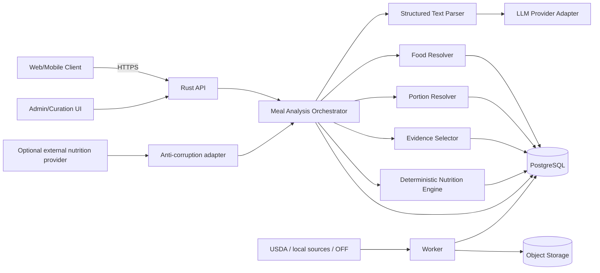

# Nutrition Intelligence Backend Blueprint v1.0

**Trạng thái:** Development-ready architecture baseline  
**Phiên bản:** 1.0.0  
**Ngày phát hành:** 2026-07-23  
**Ngôn ngữ:** Tiếng Việt  
**Định hướng:** Evidence-based food knowledge system, modular monolith, PostgreSQL-first, deterministic calculation, LLM-assisted understanding

## 1. Mục đích

Bộ tài liệu này là kim chỉ nam sản phẩm, dữ liệu và kỹ thuật cho backend nhận mô tả bữa ăn bằng văn bản tự do, sau đó:

```text
text tự do
→ trích xuất food mentions
→ phân giải thực thể món/thực phẩm
→ phân giải khẩu phần và phần ăn được
→ chọn evidence thành phần dinh dưỡng
→ tính toán xác định
→ trả estimate + giả định + chất lượng dữ liệu + provenance
→ cho phép xác nhận/correction
```

Hệ thống **không** được thiết kế như một chatbot đoán calories. Mọi con số quan trọng phải truy ngược được tới food identity, portion evidence, composition profile, recipe version, source release và calculation engine version.

## 2. Những quyết định bất biến của v1.0

1. **Một identity thống nhất:** `food_entity` đại diện cho nguyên liệu, thực phẩm đã chế biến, món ăn hoặc sản phẩm đóng gói. `ingredient` là vai trò của food trong một `recipe_version`.
2. **Món ăn tách khỏi công thức:** một món có thể có nhiều recipe, vùng miền, phiên bản và quality grade.
3. **Nutrient là evidence:** không đặt `protein`, `fat`, `calories` trực tiếp trên food như một sự thật duy nhất.
4. **Published data bất biến:** mọi sửa đổi tạo version mới; analysis cũ phải tái tạo được.
5. **LLM chỉ hiểu ngôn ngữ:** không tự tạo food ID, gram hoặc calories. Output bắt buộc theo schema và qua validation.
6. **PostgreSQL là source of truth:** search engine, graph database, Redis, Kafka và Kubernetes chỉ được thêm khi có measurement và ADR.
7. **Human curation là bắt buộc:** importer, model và user feedback không được tự publish canonical data.
8. **Estimate không phải measurement:** API/UI phải thể hiện assumption, evidence quality, ambiguity và bounded uncertainty.
9. **Product loop được ưu tiên ngang backend correctness:** user phải có thể xác nhận hoặc sửa interpretation nhanh chóng.
10. **Kiến trúc đích lớn, đường triển khai nhỏ:** bắt đầu bằng walking skeleton có 10 món, không xây toàn bộ knowledge platform trước khi có feedback thật.

## 3. Kiến trúc ở một trang



### Runtime tối thiểu

```text
1 codebase
2 process types: api + worker
1 PostgreSQL cluster
1 object-storage bucket
1 hosted LLM provider sau adapter
1 internal curation UI
optional: external nutrition provider dùng trong baseline/shadow mode
```

## 4. Cấu trúc logical database

```text
raw          source artifacts, releases, immutable raw records
catalog      canonical food identity, names, taxonomy, mappings
recipe       recipe, version, components, process, dependency graph
composition  nutrients, profiles, values, portions, factors
analysis     request, revision, item, candidate, evidence, result snapshot
app          users, meals, corrections, idempotency, consent
ops          jobs, outbox, audit, prompt/model/source registries
```

Đây là logical schemas trong **một PostgreSQL database**, không phải bảy database vật lý.

## 5. Bộ tài liệu

| File | Nội dung | Owner chính |
|---|---|---|
| `01_FINAL_REVIEW_AND_DECISIONS.md` | Review cuối, market findings, quyết định chốt | Architect/tech lead |
| `02_PRODUCT_SCOPE_AND_REQUIREMENTS.md` | Persona, use case, SLO, acceptance, non-goals | Product + engineering |
| `03_DOMAIN_MODEL.md` | Ubiquitous language, aggregate, invariant | Backend/data |
| `04_DATABASE_ARCHITECTURE_AND_ERD.md` | Schemas, ERD, SQL, transaction, lifecycle | Backend/DBA |
| `05_NUTRITION_CALCULATION_SPEC.md` | Công thức, basis, yield, missing, uncertainty | Domain/QA |
| `06_FOOD_RESOLUTION_AND_LLM_SPEC.md` | NLP, retrieval, scoring, provider strategy | AI/backend |
| `07_DATA_SOURCE_QUALITY_AND_GOVERNANCE.md` | Import, mapping, provenance, publish | Data/curation |
| `08_API_AND_RUNTIME_ARCHITECTURE.md` | API, orchestration, jobs, deployment | Backend/DevOps |
| `09_TESTING_EVALUATION_AND_OBSERVABILITY.md` | Test, benchmark, metrics, telemetry | QA/SRE/AI |
| `10_SECURITY_PRIVACY_AND_PRODUCT_SAFETY.md` | Threats, privacy, product claims | Security/product |
| `11_DELIVERY_ROADMAP.md` | Walking skeleton, phases, gates | Delivery lead |
| `12_ARCHITECTURE_DECISION_RECORDS.md` | ADR-001…ADR-016 | Toàn đội |
| `13_IMPLEMENTATION_CHECKLIST.md` | Definition of Ready/Done/Launch | Engineering manager |
| `14_OFFICIAL_REFERENCES.md` | Nguồn chính thức và research policy | Architect/data |
| `15_OPEN_SOURCE_AND_MARKET_REFERENCE_STRATEGY.md` | Build/buy/reuse, repo review | Architect/product |
| `16_VIETNAMESE_MEAL_BENCH_SPEC.md` | Benchmark tiếng Việt end-to-end | AI/QA/domain |
| `17_CLARIFICATION_CORRECTION_UX_SPEC.md` | State machine và interaction contract | Product/backend |
| `18_SOURCE_ADAPTER_CONTRACT.md` | Contract import dataset/provider | Data/backend |
| `19_RELEASE_AND_CHANGE_MANAGEMENT.md` | Versioning, compatibility, rollback | Release owner |
| `20_CHANGELOG.md` | Thay đổi từ baseline lên v1.0 | Toàn đội |

## 6. Thứ tự đọc khuyến nghị

### Product/leadership

```text
00 → 01 → 02 → 11 → 15 → 19
```

### Backend/data engineer

```text
00 → 03 → 04 → 05 → 07 → 08 → 18 → 12
```

### AI/ML/quality

```text
00 → 06 → 09 → 16 → 17 → 05
```

### Security/operations

```text
00 → 08 → 09 → 10 → 19 → 13
```

## 7. Scope theo ba mức

### Walking skeleton

- 20 basic foods.
- 10 món Việt.
- 10 household measures.
- 50–100 annotated meal texts.
- Energy, protein, carbohydrate, fat.
- Một source release.
- Một LLM provider.
- Một clarification flow và một correction flow.
- End-to-end reproducibility.

### MVP beta

- 100–200 basic foods.
- 50–100 món Việt curated.
- 20–30 measures.
- 300–500 annotated texts, sau đó mở rộng theo error slices.
- Exact/alias/trigram retrieval, rule-based ranking.
- Recipe versioning, composition profiles, portion observations.
- Curation UI, provenance, analysis revision.

### Chưa thuộc MVP

- Image recognition.
- Full barcode experience.
- Personalized ML portion prediction.
- Vector retrieval và LLM reranker.
- Full micronutrient coverage.
- Graph database.
- Self-hosted model, Kafka, Kubernetes, multi-region active-active.
- Chẩn đoán, điều trị hoặc chế độ ăn y khoa.

## 8. Development readiness gates

### Gate 0 — Documents ready

- Không còn file rỗng.
- ADR nền tảng được accepted.
- Scope/non-goals được product owner duyệt.
- Calculation policy và missing-data policy được domain reviewer duyệt.

### Gate 1 — Walking skeleton ready

- End-to-end request có snapshot và provenance.
- Correction tạo analysis revision mới.
- Calculator chạy offline, không gọi network.
- Restore database từ backup đã được thử.

### Gate 2 — Data ready

- Source/license register hoàn chỉnh.
- Catalog seed có review owner.
- Unknown food không bị ép match.
- Published version bất biến.

### Gate 3 — Beta ready

- VietnameseMealBench acceptance gates đạt.
- Product copy dùng “ước tính”.
- Clarification UX đạt task-completion target.
- Security/privacy checklist không còn blocker.
- Cost per analysis nằm trong budget.

## 9. Nguyên tắc quản trị thay đổi

- Domain invariant thay đổi → ADR mới hoặc supersede ADR cũ.
- Calculation behavior thay đổi → tăng `calculation_engine_version` và regression report.
- Parser schema thay đổi → tăng `parser_schema_version`.
- Retrieval/ranking behavior thay đổi → behavior release + benchmark comparison.
- Published recipe/composition/portion thay đổi → version mới, không update-in-place.
- Dataset activation → change report, impact preview, rollback target.
- API breaking change → major API version.
- Tài liệu thay đổi cùng pull request với code/migration liên quan.

## 10. Tiêu chí blueprint v1.0 đạt yêu cầu

Một developer mới phải có thể:

1. Giải thích food identity, source record, recipe và composition profile.
2. Thêm một món mới mà không sửa schema.
3. Chạy walking skeleton bằng local environment.
4. Tái tạo estimate cũ bằng đúng version và evidence.
5. Biết lúc nào resolve, hỏi lại hoặc trả `insufficient_evidence`.
6. Viết test calculator không gọi LLM/database/network.
7. Biết phần nào build, phần nào buy hoặc chỉ tham khảo open source.
8. Xác định owner, gate và artifact của từng phase.

## 11. Definition of “v1.0”

`v1.0` nghĩa là tài liệu **đủ để bắt đầu phát triển có kiểm soát**, không có nghĩa mọi câu hỏi domain đã có đáp án cuối cùng. Các assumption chưa được thực nghiệm phải được ghi trong risk register, VietnameseMealBench hoặc ADR trạng thái `proposed`.
