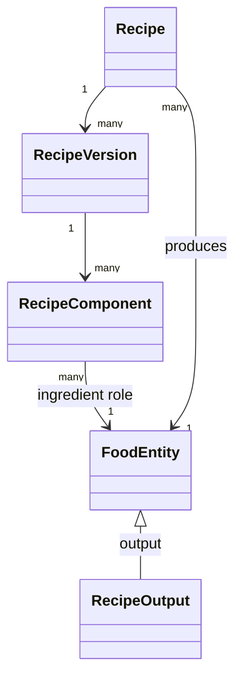

# Domain model

**Phiên bản:** 1.0.0  
**Trạng thái:** Normative domain specification  
**Liên quan:** ADR-004…ADR-012, FR-003…FR-012


## 1. Ubiquitous language

### Food entity

Canonical identity nội bộ cho một vật chất/sản phẩm/món ăn có thể được tiêu thụ hoặc dùng như thành phần. Food entity không chứa trực tiếp một bộ nutrient duy nhất.

### Food name

Tên preferred hoặc alias theo locale, region và name type. Tên là dữ liệu tìm kiếm, không phải identity.

### Source food record

Bản ghi từ một dataset release cụ thể. Nó giữ ngữ nghĩa nguồn và không tự động trở thành canonical entity.

### Food mapping

Quyết định liên kết source food record với canonical food entity, kèm phương pháp, score, trạng thái review và reviewer.

### Recipe

Khái niệm công thức tạo ra một output food. Recipe chứa metadata ổn định; nội dung nguyên liệu nằm trong recipe version.

### Recipe version

Snapshot bất biến của ingredient components, quantities, processing và yield. Chỉ version `published` được calculation policy mặc định sử dụng.

### Recipe component

Một food entity đóng vai trò ingredient trong recipe version. Có amount, unit, resolved weight, edible fraction và preparation context.

### Composition profile

Một bộ nutrient values tương thích theo cùng food, basis, source/method và thời điểm. Ví dụ laboratory, manufacturer label, recipe-calculated, compiled hoặc imputed.

### Composition value

Một nutrient amount trong profile, có value status như measured, calculated, estimated, trace, not_detected hoặc missing.

### Portion observation

Bằng chứng rằng một amount của household measure tương ứng một gram weight trong food/context cụ thể.

### Meal analysis

Một lần xử lý raw text, có parser version, resolution decisions, calculation inputs và output.

### Analysis revision

Snapshot bất biến của kết quả. Correction tạo revision mới.

### Evidence

Tập các ID/version/source đã dùng để tạo result.

## 2. Core distinction matrix

| Khái niệm | Identity? | Versioned? | Có nutrient trực tiếp? | Ví dụ |
|---|---:|---:|---:|---|
| Food entity | Có | Lifecycle, không content version | Không | Phở bò Huế |
| Source food record | Theo external dataset | Theo dataset release | Có thể chứa raw | USDA FDC 123 |
| Recipe | Có | Metadata | Không | Công thức phở miền Bắc |
| Recipe version | Có | Bất biến | Sinh profile tính toán | v3 |
| Composition profile | Có | Publish revision | Có | lab profile per 100 g |
| Portion observation | Có | Effective dating | Không | 1 tô = 550 g |
| Analysis revision | Có | Bất biến | Có result snapshot | revision 2 |

## 3. Bounded contexts

### 3.1 Catalog context

Chịu trách nhiệm:

- Canonical identity.
- Names và aliases.
- Taxonomy/facets.
- Source mappings.
- Merge/deprecate food.

Không chịu trách nhiệm tính calories.

### 3.2 Recipe context

- Recipe identity.
- Versioning.
- Components.
- Processing/yield metadata.
- Dependency graph và cycle prevention.

### 3.3 Composition context

- Nutrient vocabulary.
- Profiles và values.
- Portion observations.
- Density, edible fraction, yield/retention factors.
- Profile selection policy.

### 3.4 Meal analysis context

- Text parsing DTO.
- Candidate resolution.
- Clarification.
- Calculation orchestration.
- Immutable snapshots.

### 3.5 App context

- User/account.
- Meal logs.
- Preferences.
- Corrections.
- Consent/deletion.

### 3.6 Data operations context

- Dataset import.
- Mapping proposals.
- Review queues.
- Prompt/model registry.
- Jobs/outbox/audit.

## 4. Aggregate boundaries

### Food aggregate

Root: `FoodEntity`.

Có thể thay đổi atomically:

- Lifecycle status.
- Preferred names.
- Curated aliases.
- Taxonomy assignments.

Source mappings có workflow riêng và không cần lock toàn aggregate khi import lớn.

### Recipe aggregate

Root: `Recipe` cho metadata; `RecipeVersion` là immutable aggregate khi publish.

Publish transaction phải xác nhận:

- Components hợp lệ.
- Units resolved.
- Không cycle.
- Output yield đủ dùng hoặc có explicit unknown policy.
- Source/owner hợp lệ.

### Composition profile aggregate

Root: `CompositionProfile`.

Publish yêu cầu:

- Basis hợp lệ.
- Unit canonical.
- Không duplicate nutrient.
- Value status nhất quán.
- Source hoặc calculation run tồn tại.

### Analysis aggregate

Root: `MealAnalysis`.

`AnalysisRevision` append-only. Mỗi revision chứa item snapshots và result snapshots.

## 5. Entity kinds

`food_entity.entity_kind` chỉ là coarse discriminator:

- `basic_food`: nguyên liệu tự nhiên hoặc ít chế biến.
- `processed_food`: generic processed food không gắn brand.
- `dish`: composite food/món.
- `branded_product`: sản phẩm có brand/manufacturer identity.

Không dùng `entity_kind` làm taxonomy chi tiết. Một food có thể đổi cách phân loại sau curation mà không đổi identity nếu semantic identity vẫn giữ.

## 6. Food identity rules

Tạo food entity mới khi khác biệt có khả năng làm thay đổi:

- Nutrient composition đáng kể.
- Recipe/ingredient semantics.
- State/preparation mà người dùng thường phân biệt.
- Branded SKU/formulation.
- Edible portion hoặc measurement behavior.

Không tạo entity mới chỉ vì:

- Sai chính tả.
- Tên không dấu.
- Alias vùng miền nhưng cùng semantic food.
- Packaging size nếu composition giống và portion có thể biểu diễn riêng.

Ví dụ cần cân nhắc:

```text
“trứng gà” và “trứng gà luộc”
```

Nên là hai entities nếu có direct composition profile và preparation state khác rõ; có relation `derived_from` hoặc taxonomy facet. Không chỉ gắn một string `preparation_method` lên cùng record.

## 7. Ingredient as role



Không tồn tại master `ingredient` độc lập. Có thể có `component_role`:

- primary ingredient.
- seasoning.
- cooking medium.
- garnish.
- optional component.

Role giúp calculation/UX nhưng không thay identity.

## 8. Recipe variants

Một output food có nhiều recipes:

```text
Food: Phở bò
  Recipe A: miền Bắc, curated baseline
  Recipe B: miền Nam, curated baseline
  Recipe C: user recipe
  Recipe D: restaurant/brand formulation
```

Selection policy dựa trên:

- Explicit region/brand/user choice.
- User preference.
- Locale default.
- Curated default flag.
- Evidence quality.

Không chọn recipe mới nhất chỉ vì version number cao hơn nếu không cùng recipe identity.

## 9. Composition semantics

### Basis

Profile phải khai báo basis:

- per 100 g edible portion.
- per serving.
- per package.
- per 100 ml.

Canonical calculation input ưu tiên chuyển về per 100 g edible basis. Conversion chỉ hợp lệ khi có density/portion evidence tương thích.

### Value status

- `measured`: phân tích trực tiếp.
- `declared`: nhãn/nhà sản xuất công bố; có thể tách khỏi measured.
- `calculated`: từ recipe hoặc formula có trace.
- `compiled`: kết hợp có policy và compilation run.
- `estimated`: ước lượng từ similar food.
- `trace`: có nhưng dưới reporting threshold.
- `not_detected`: phương pháp không phát hiện.
- `missing`: không có dữ liệu.

`0` chỉ dùng khi source thực sự biểu thị zero theo semantics đã biết.

## 10. Relations giữa foods

MVP chỉ hỗ trợ relation types có giá trị trực tiếp:

- `derived_from`.
- `variant_of`.
- `substitute_for`.
- `same_as_external` chỉ cho external ontology ID đã review.
- `contains_component` không lưu trực tiếp nếu đã có recipe component.

Không xây generic graph triple store trong MVP.

## 11. Taxonomy và facets

Food có thể gắn nhiều taxon từ nhiều taxonomy:

- culinary type.
- main ingredient family.
- processing state.
- physical state.
- region/cuisine.
- branded category.
- allergen/dietary metadata nếu có source.

Taxonomy relations mặc định là tree/DAG nhỏ. Không ép mọi facet vào một parent tree.

## 12. Domain invariants

### Catalog

1. Food ID không tái sử dụng.
2. Deprecated food phải có replacement hoặc reason.
3. Một locale/region chỉ có tối đa một preferred name active cho food.
4. Merge không xóa source mappings; chuyển alias/reference và lưu merge event.
5. Mapping `approved` phải có reviewer hoặc approved automation policy version.

### Recipe

1. Published recipe version immutable.
2. Output food không xuất hiện trong transitive component graph.
3. Component quantity > 0, trừ explicit optional template chưa publish.
4. Resolved gram required khi calculation mode cần mass.
5. Edible fraction nằm trong `(0, 1]` hoặc unknown.
6. Version number tăng đơn điệu trong recipe.
7. Chỉ một default published version active theo scope/region/time.

### Composition

1. Profile có đúng một food.
2. Mỗi nutrient tối đa một active value trong profile.
3. Missing không được materialize thành zero.
4. Calculated profile phải trỏ calculation run và recipe version.
5. Profile basis phải convert được hoặc bị loại khỏi selection.
6. Declared label values giữ nguyên raw precision; normalized value lưu riêng.

### Portion

1. Gram weight > 0.
2. Measure amount > 0.
3. Portion observation có source/method.
4. Percentile chỉ được lưu nếu có sample count/method hỗ trợ.
5. User-specific observation không tự động trở thành global curated observation.

### Analysis

1. Completed revision immutable.
2. Mỗi result item có resolved food hoặc unresolved status.
3. Không có result calories nếu mass và basis không xác định, trừ explicit fallback estimate policy.
4. Correction không overwrite revision.
5. Snapshot phải giữ policy/model/data IDs.

## 13. Domain services

### FoodResolutionPolicy

Input candidates + mention context; output resolution decision hoặc clarification.

### PortionResolutionPolicy

Input quantity/unit/food/user context; output mass estimate, bounds, evidence và quality.

### CompositionSelectionPolicy

Input food, date, locale, recipe context; output profile hoặc failure reason.

### NutritionCalculator

Input immutable calculation DTO; output nutrients + trace + warnings.

### AnalysisQualityPolicy

Kết hợp evidence grades thành label:

- high.
- medium.
- low.
- insufficient.

Không gọi đây là probability trước calibration.

## 14. Domain events

- `FoodCreated`.
- `FoodMerged`.
- `FoodDeprecated`.
- `RecipeVersionPublished`.
- `CompositionProfilePublished`.
- `DatasetReleaseImported`.
- `SourceMappingApproved`.
- `MealAnalysisCompleted`.
- `MealAnalysisCorrected`.
- `UnknownFoodObserved`.

Events được ghi transactional outbox để analytics/worker xử lý sau; domain operation không phụ thuộc broker.

## 15. Anti-corruption layers

External source fields không rò vào domain types. Ví dụ:

```text
FDC dataType / nutrientNumber / servingSize
    ↓ source adapter
Internal SourceFoodRecord / NutrientCode / PortionObservation
```

Tương tự, LLM provider response được map vào `ParsedMealDocument`, không truyền provider-specific object vào application layer.

## 16. v1.0 additions: interaction and integration concepts

### Analysis state

`analysis_state` là lifecycle state, không phải business result:

```text
received → parsing → resolving → needs_clarification/completed/insufficient
completed → confirmed/corrected
```

State transition thuộc application aggregate; chi tiết interaction nằm trong `17_CLARIFICATION_CORRECTION_UX_SPEC.md`.

### Clarification question

Một immutable question generated cho một analysis revision, gồm `dimension`, prompt, options, policy version và expected impact metadata. Answer chỉ hợp lệ cho revision/question hiện tại.

### Correction

Một assertion của user/curator về interpretation hoặc portion của analysis. Correction không tự sửa canonical catalog; nó tạo revision mới và có thể sinh curation candidate.

### Provider result

Kết quả từ external nutrition provider là external evidence/baseline object, không phải canonical food/composition. Provider IDs không được dùng làm internal identity.

### Source release activation

Activation là pointer/policy state quyết định source release nào được selection policy dùng cho request mới. Nó không sửa analysis cũ.

## 17. Aggregate interaction rules

- `Analysis` tham chiếu immutable IDs của catalog/recipe/composition nhưng không sở hữu các aggregate đó.
- `Recipe` không gọi calculator; calculator nhận published recipe snapshot/input.
- `Catalog` không tự chọn profile; `CompositionSelectionPolicy` thực hiện theo request context.
- `Correction` chỉ thuộc Analysis aggregate; promotion sang catalog đi qua separate curation workflow.
- `DatasetRelease` không publish canonical mapping trực tiếp.

## 18. Domain error taxonomy

```text
InvalidInput
UnsupportedUnit
UnknownFood
AmbiguousFood
InsufficientPortionEvidence
InsufficientCompositionEvidence
RecipeCycle
RecipeDepthExceeded
IncompatibleBasis
MissingRequiredNutrient
StaleClarification
VersionConflict
UnpublishedEvidence
```

Domain errors không chứa HTTP status; interface adapter map sang API error codes.

## 19. Requirement mapping

| Domain concept | Requirements |
|---|---|
| Food resolution | FR-002, FR-003 |
| Portion observation | FR-004 |
| Composition profile | FR-005 |
| Calculator | FR-006 |
| Analysis revision | FR-007, FR-009, FR-012 |
| Clarification | FR-008 |
| Curation/source release | FR-010, FR-011 |
