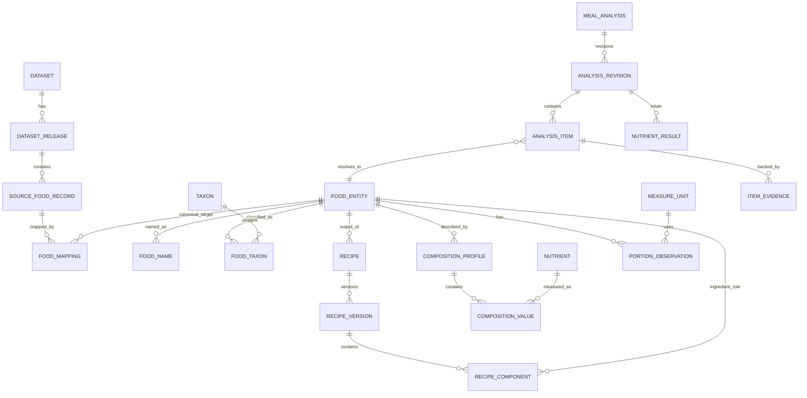

# Database architecture và ERD

**Phiên bản:** 1.0.0  
**Trạng thái:** Development baseline  
**Target:** PostgreSQL 18 supported release


## 1. Mục tiêu thiết kế

Database phải hỗ trợ đồng thời:

- Canonical identity ổn định.
- Nhiều nguồn và release.
- Recipe versioning và nested components.
- Nhiều composition profiles cho một food.
- Portion có context.
- Immutable analysis snapshots.
- Human curation/audit.
- Search đủ tốt mà chưa cần vector database.

## 2. Physical topology

MVP dùng một managed PostgreSQL stable release, một primary và backup/replica tùy dịch vụ. Logical schemas không phải micro-databases.

```text
nutrition_db
├── raw
├── catalog
├── recipe
├── composition
├── analysis
├── app
└── ops
```

Object storage lưu dataset snapshot/raw artifacts lớn. PostgreSQL lưu checksum, URI, import metadata và records cần query.

## 3. High-level ERD



## 4. Naming và datatype conventions

- Primary key: UUID v7 hoặc time-sortable UUID do application sinh.
- Timestamp: `timestamptz` UTC.
- Enum thay đổi thường xuyên: lookup table hoặc `text + CHECK`; không lạm dụng PostgreSQL enum.
- Measurement: `numeric` trong persistence khi cần reproducibility; domain có typed wrapper.
- JSONB: raw payload, flexible metadata và snapshots; không dùng thay relational columns cốt lõi.
- Soft delete chỉ dùng khi legal/audit yêu cầu; canonical entities dùng lifecycle status.
- Table/column dùng snake_case.

## 5. `raw` schema

### 5.1 `raw.dataset`

```sql
CREATE TABLE raw.dataset (
    id uuid PRIMARY KEY,
    code text NOT NULL UNIQUE,
    name text NOT NULL,
    publisher text NOT NULL,
    license_code text,
    homepage text,
    ingestion_policy_version text NOT NULL,
    created_at timestamptz NOT NULL DEFAULT now()
);
```

### 5.2 `raw.dataset_release`

```sql
CREATE TABLE raw.dataset_release (
    id uuid PRIMARY KEY,
    dataset_id uuid NOT NULL REFERENCES raw.dataset(id),
    version text NOT NULL,
    published_at timestamptz,
    imported_at timestamptz NOT NULL,
    checksum_sha256 text NOT NULL,
    object_uri text NOT NULL,
    record_count bigint,
    status text NOT NULL CHECK (status IN
      ('received','validated','imported','failed','superseded')),
    metadata jsonb NOT NULL DEFAULT '{}',
    UNIQUE (dataset_id, version),
    UNIQUE (dataset_id, checksum_sha256)
);
```

### 5.3 `raw.source_food_record`

```sql
CREATE TABLE raw.source_food_record (
    id uuid PRIMARY KEY,
    dataset_release_id uuid NOT NULL REFERENCES raw.dataset_release(id),
    external_id text NOT NULL,
    source_data_type text,
    source_description text NOT NULL,
    normalized_search_text text,
    raw_payload jsonb NOT NULL,
    payload_hash text NOT NULL,
    created_at timestamptz NOT NULL DEFAULT now(),
    UNIQUE (dataset_release_id, external_id)
);
```

Không update raw payload trong cùng release. Nếu upstream thay record, đó là release/import artifact mới.

## 6. `catalog` schema

### 6.1 `catalog.food_entity`

```sql
CREATE TABLE catalog.food_entity (
    id uuid PRIMARY KEY,
    entity_kind text NOT NULL CHECK (entity_kind IN
      ('basic_food','processed_food','dish','branded_product')),
    lifecycle_status text NOT NULL CHECK (lifecycle_status IN
      ('draft','active','deprecated','merged','rejected')),
    replacement_food_id uuid REFERENCES catalog.food_entity(id),
    semantic_key text,
    created_by uuid,
    created_at timestamptz NOT NULL DEFAULT now(),
    updated_at timestamptz NOT NULL DEFAULT now(),
    CHECK (
      (lifecycle_status IN ('deprecated','merged') AND replacement_food_id IS NOT NULL)
      OR lifecycle_status NOT IN ('deprecated','merged')
    )
);
```

`semantic_key` chỉ dùng cho curated stable code nếu có; không lấy normalized name làm unique identity.

### 6.2 `catalog.food_name`

```sql
CREATE TABLE catalog.food_name (
    id uuid PRIMARY KEY,
    food_id uuid NOT NULL REFERENCES catalog.food_entity(id),
    locale text NOT NULL,
    region_code text,
    name text NOT NULL,
    normalized_name text NOT NULL,
    name_type text NOT NULL CHECK (name_type IN
      ('preferred','alias','colloquial','brand','misspelling','transliteration')),
    is_curated boolean NOT NULL DEFAULT false,
    source_record_id uuid REFERENCES raw.source_food_record(id),
    valid_from timestamptz NOT NULL DEFAULT now(),
    valid_to timestamptz,
    search_weight smallint NOT NULL DEFAULT 0,
    CHECK (valid_to IS NULL OR valid_to > valid_from)
);
```

Partial unique index cho preferred active name:

```sql
CREATE UNIQUE INDEX uq_food_preferred_name_scope
ON catalog.food_name(food_id, locale, COALESCE(region_code, ''))
WHERE name_type = 'preferred' AND valid_to IS NULL;
```

Search indexes:

```sql
CREATE INDEX ix_food_name_normalized
ON catalog.food_name(normalized_name);

CREATE INDEX ix_food_name_trgm
ON catalog.food_name USING gin (normalized_name gin_trgm_ops)
WHERE valid_to IS NULL;
```

### 6.3 Source mapping

```sql
CREATE TABLE catalog.food_mapping (
    id uuid PRIMARY KEY,
    source_food_record_id uuid NOT NULL REFERENCES raw.source_food_record(id),
    food_id uuid NOT NULL REFERENCES catalog.food_entity(id),
    mapping_type text NOT NULL CHECK (mapping_type IN
      ('exact','broader','narrower','approximate','rejected')),
    mapping_method text NOT NULL,
    score double precision,
    policy_version text NOT NULL,
    review_status text NOT NULL CHECK (review_status IN
      ('proposed','approved','rejected','superseded')),
    reviewed_by uuid,
    reviewed_at timestamptz,
    rationale text,
    created_at timestamptz NOT NULL DEFAULT now()
);
```

Không unique tuyệt đối source→food vì lịch sử proposals cần giữ. Dùng partial unique cho approved current mapping nếu policy yêu cầu.

### 6.4 Taxonomy

```sql
CREATE TABLE catalog.taxonomy (
    id uuid PRIMARY KEY,
    code text NOT NULL UNIQUE,
    name text NOT NULL,
    structure_type text NOT NULL CHECK (structure_type IN ('tree','dag','flat')),
    source text,
    version text
);

CREATE TABLE catalog.taxon (
    id uuid PRIMARY KEY,
    taxonomy_id uuid NOT NULL REFERENCES catalog.taxonomy(id),
    code text NOT NULL,
    label text NOT NULL,
    parent_id uuid REFERENCES catalog.taxon(id),
    metadata jsonb NOT NULL DEFAULT '{}',
    UNIQUE (taxonomy_id, code)
);

CREATE TABLE catalog.food_taxon (
    food_id uuid NOT NULL REFERENCES catalog.food_entity(id),
    taxon_id uuid NOT NULL REFERENCES catalog.taxon(id),
    assignment_method text NOT NULL,
    source_record_id uuid REFERENCES raw.source_food_record(id),
    review_status text NOT NULL,
    PRIMARY KEY (food_id, taxon_id)
);
```

Nếu taxonomy là DAG, dùng table `taxon_edge` thay parent_id; không dùng cả hai trong cùng taxonomy mà không có rule rõ.

### 6.5 Food relations

```sql
CREATE TABLE catalog.food_relation (
    subject_food_id uuid NOT NULL REFERENCES catalog.food_entity(id),
    relation_type text NOT NULL CHECK (relation_type IN
      ('variant_of','derived_from','substitute_for','external_equivalent')),
    object_food_id uuid NOT NULL REFERENCES catalog.food_entity(id),
    source_record_id uuid REFERENCES raw.source_food_record(id),
    review_status text NOT NULL,
    PRIMARY KEY (subject_food_id, relation_type, object_food_id),
    CHECK (subject_food_id <> object_food_id)
);
```

## 7. `recipe` schema

### 7.1 Recipe và version

```sql
CREATE TABLE recipe.recipe (
    id uuid PRIMARY KEY,
    output_food_id uuid NOT NULL REFERENCES catalog.food_entity(id),
    recipe_type text NOT NULL CHECK (recipe_type IN
      ('curated_baseline','regional_variant','manufacturer','user_defined')),
    region_code text,
    owner_user_id uuid,
    lifecycle_status text NOT NULL,
    created_at timestamptz NOT NULL DEFAULT now()
);

CREATE TABLE recipe.recipe_version (
    id uuid PRIMARY KEY,
    recipe_id uuid NOT NULL REFERENCES recipe.recipe(id),
    version_number integer NOT NULL CHECK (version_number > 0),
    status text NOT NULL CHECK (status IN
      ('draft','in_review','published','deprecated','rejected')),
    raw_total_weight_g numeric(14,4),
    cooked_total_weight_g numeric(14,4),
    serving_count numeric(12,4),
    declared_yield_factor numeric(10,6),
    source_record_id uuid REFERENCES raw.source_food_record(id),
    notes text,
    created_by uuid,
    created_at timestamptz NOT NULL DEFAULT now(),
    published_at timestamptz,
    UNIQUE (recipe_id, version_number),
    CHECK (raw_total_weight_g IS NULL OR raw_total_weight_g > 0),
    CHECK (cooked_total_weight_g IS NULL OR cooked_total_weight_g > 0),
    CHECK (serving_count IS NULL OR serving_count > 0)
);
```

Application/trigger ngăn update content khi status đã `published`.

### 7.2 Components

```sql
CREATE TABLE recipe.recipe_component (
    id uuid PRIMARY KEY,
    recipe_version_id uuid NOT NULL REFERENCES recipe.recipe_version(id),
    component_food_id uuid NOT NULL REFERENCES catalog.food_entity(id),
    component_role text NOT NULL DEFAULT 'ingredient',
    sequence_number integer NOT NULL,
    quantity numeric(14,6) NOT NULL CHECK (quantity > 0),
    unit_id uuid NOT NULL,
    resolved_weight_g numeric(14,4),
    edible_fraction numeric(8,6),
    preparation_method_code text,
    is_optional boolean NOT NULL DEFAULT false,
    notes text,
    UNIQUE (recipe_version_id, sequence_number),
    CHECK (resolved_weight_g IS NULL OR resolved_weight_g > 0),
    CHECK (edible_fraction IS NULL OR edible_fraction > 0 AND edible_fraction <= 1)
);
```

### 7.3 Recipe process

```sql
CREATE TABLE recipe.recipe_process_step (
    id uuid PRIMARY KEY,
    recipe_version_id uuid NOT NULL REFERENCES recipe.recipe_version(id),
    sequence_number integer NOT NULL,
    process_code text NOT NULL,
    duration_seconds integer,
    temperature_c numeric(8,2),
    parameters jsonb NOT NULL DEFAULT '{}',
    UNIQUE (recipe_version_id, sequence_number)
);
```

### 7.4 Cycle check

Trước publish, query transitive dependencies từ output food qua recipe components. Pseudocode SQL:

```sql
WITH RECURSIVE dependency(food_id, depth, path) AS (
  SELECT rc.component_food_id, 1, ARRAY[rv.id]
  FROM recipe.recipe_component rc
  JOIN recipe.recipe_version rv ON rv.id = rc.recipe_version_id
  WHERE rv.id = $candidate_version

  UNION ALL

  SELECT child_rc.component_food_id,
         d.depth + 1,
         d.path || child_rv.id
  FROM dependency d
  JOIN recipe.recipe child_r ON child_r.output_food_id = d.food_id
  JOIN recipe.recipe_version child_rv ON child_rv.recipe_id = child_r.id
       AND child_rv.status = 'published'
  JOIN recipe.recipe_component child_rc
       ON child_rc.recipe_version_id = child_rv.id
  WHERE d.depth < $max_depth
)
SELECT 1 FROM dependency
WHERE food_id = $output_food_id
LIMIT 1;
```

Application vẫn là nơi orchestration và error message; DB constraint/trigger có thể làm defense-in-depth.

## 8. `composition` schema

### 8.1 Nutrient vocabulary

```sql
CREATE TABLE composition.nutrient (
    id uuid PRIMARY KEY,
    code text NOT NULL UNIQUE,
    preferred_name text NOT NULL,
    canonical_unit text NOT NULL,
    nutrient_group text NOT NULL,
    external_identifiers jsonb NOT NULL DEFAULT '{}',
    is_energy_component boolean NOT NULL DEFAULT false
);
```

### 8.2 Composition profile

```sql
CREATE TABLE composition.composition_profile (
    id uuid PRIMARY KEY,
    food_id uuid NOT NULL REFERENCES catalog.food_entity(id),
    profile_type text NOT NULL CHECK (profile_type IN
      ('laboratory','declared_label','recipe_calculated','compiled','imputed')),
    basis_amount numeric(14,6) NOT NULL CHECK (basis_amount > 0),
    basis_unit text NOT NULL,
    edible_basis boolean NOT NULL,
    source_record_id uuid REFERENCES raw.source_food_record(id),
    recipe_version_id uuid REFERENCES recipe.recipe_version(id),
    calculation_run_id uuid,
    quality_grade text NOT NULL CHECK (quality_grade IN ('A','B','C','D','U')),
    status text NOT NULL CHECK (status IN
      ('draft','in_review','published','deprecated','rejected')),
    valid_from timestamptz,
    valid_to timestamptz,
    method_metadata jsonb NOT NULL DEFAULT '{}',
    created_at timestamptz NOT NULL DEFAULT now(),
    CHECK (valid_to IS NULL OR valid_from IS NULL OR valid_to > valid_from)
);
```

### 8.3 Composition value

```sql
CREATE TABLE composition.composition_value (
    profile_id uuid NOT NULL REFERENCES composition.composition_profile(id),
    nutrient_id uuid NOT NULL REFERENCES composition.nutrient(id),
    amount numeric(18,8),
    canonical_amount numeric(18,8),
    unit text NOT NULL,
    minimum_amount numeric(18,8),
    maximum_amount numeric(18,8),
    value_status text NOT NULL CHECK (value_status IN
      ('measured','declared','calculated','compiled','estimated','trace','not_detected','missing')),
    significant_figures smallint,
    method_code text,
    PRIMARY KEY (profile_id, nutrient_id),
    CHECK (
      (value_status = 'missing' AND amount IS NULL)
      OR (value_status <> 'missing')
    )
);
```

### 8.4 Measure units

```sql
CREATE TABLE composition.measure_unit (
    id uuid PRIMARY KEY,
    code text NOT NULL UNIQUE,
    dimension text NOT NULL CHECK (dimension IN
      ('mass','volume','count','household','serving')),
    canonical_label_vi text NOT NULL,
    aliases jsonb NOT NULL DEFAULT '[]'
);
```

Mass conversion cố định chỉ áp dụng cho mass unit. Volume→mass cần density; household/count→mass cần observation.

### 8.5 Portion observation

```sql
CREATE TABLE composition.portion_observation (
    id uuid PRIMARY KEY,
    food_id uuid NOT NULL REFERENCES catalog.food_entity(id),
    measure_unit_id uuid NOT NULL REFERENCES composition.measure_unit(id),
    measure_amount numeric(14,6) NOT NULL CHECK (measure_amount > 0),
    gram_weight numeric(14,4) NOT NULL CHECK (gram_weight > 0),
    lower_bound_g numeric(14,4),
    upper_bound_g numeric(14,4),
    region_code text,
    context_type text,
    source_record_id uuid REFERENCES raw.source_food_record(id),
    estimation_method text NOT NULL,
    quality_grade text NOT NULL CHECK (quality_grade IN ('A','B','C','D','U')),
    sample_count integer,
    valid_from timestamptz,
    valid_to timestamptz,
    metadata jsonb NOT NULL DEFAULT '{}',
    CHECK (lower_bound_g IS NULL OR lower_bound_g > 0),
    CHECK (upper_bound_g IS NULL OR upper_bound_g > 0),
    CHECK (lower_bound_g IS NULL OR upper_bound_g IS NULL OR lower_bound_g <= upper_bound_g)
);
```

### 8.6 Factors

```sql
CREATE TABLE composition.density_observation (
    id uuid PRIMARY KEY,
    food_id uuid REFERENCES catalog.food_entity(id),
    food_group_code text,
    grams_per_ml numeric(12,8) NOT NULL CHECK (grams_per_ml > 0),
    temperature_c numeric(8,2),
    source_record_id uuid REFERENCES raw.source_food_record(id),
    quality_grade text NOT NULL
);

CREATE TABLE composition.retention_factor (
    id uuid PRIMARY KEY,
    nutrient_id uuid NOT NULL REFERENCES composition.nutrient(id),
    process_code text NOT NULL,
    food_id uuid REFERENCES catalog.food_entity(id),
    food_group_code text,
    factor numeric(10,8) NOT NULL CHECK (factor >= 0),
    source_record_id uuid REFERENCES raw.source_food_record(id),
    quality_grade text NOT NULL
);
```

Không dùng factor nếu scope không phù hợp; fallback phải ghi warning.

## 9. `analysis` schema

### 9.1 Analysis và revision

```sql
CREATE TABLE analysis.meal_analysis (
    id uuid PRIMARY KEY,
    user_id uuid,
    raw_text_ciphertext bytea,
    locale text NOT NULL,
    occurred_at timestamptz,
    idempotency_key text,
    status text NOT NULL,
    created_at timestamptz NOT NULL DEFAULT now(),
    UNIQUE (user_id, idempotency_key)
);

CREATE TABLE analysis.analysis_revision (
    id uuid PRIMARY KEY,
    meal_analysis_id uuid NOT NULL REFERENCES analysis.meal_analysis(id),
    revision_number integer NOT NULL,
    revision_reason text NOT NULL,
    parser_provider text,
    parser_model text,
    prompt_version text,
    parser_schema_version text,
    catalog_release text,
    selection_policy_version text NOT NULL,
    calculation_engine_version text NOT NULL,
    result_status text NOT NULL,
    quality_label text NOT NULL,
    assumptions jsonb NOT NULL DEFAULT '[]',
    warnings jsonb NOT NULL DEFAULT '[]',
    created_at timestamptz NOT NULL DEFAULT now(),
    UNIQUE (meal_analysis_id, revision_number)
);
```

### 9.2 Items và candidates

```sql
CREATE TABLE analysis.analysis_item (
    id uuid PRIMARY KEY,
    revision_id uuid NOT NULL REFERENCES analysis.analysis_revision(id),
    item_index integer NOT NULL,
    source_text text NOT NULL,
    parsed_payload jsonb NOT NULL,
    resolution_status text NOT NULL,
    resolved_food_id uuid REFERENCES catalog.food_entity(id),
    resolved_recipe_version_id uuid REFERENCES recipe.recipe_version(id),
    resolved_profile_id uuid REFERENCES composition.composition_profile(id),
    resolved_portion_observation_id uuid REFERENCES composition.portion_observation(id),
    estimated_mass_g numeric(14,4),
    lower_mass_g numeric(14,4),
    upper_mass_g numeric(14,4),
    evidence_quality text NOT NULL,
    UNIQUE (revision_id, item_index)
);

CREATE TABLE analysis.resolution_candidate (
    item_id uuid NOT NULL REFERENCES analysis.analysis_item(id),
    rank integer NOT NULL,
    food_id uuid NOT NULL REFERENCES catalog.food_entity(id),
    score double precision NOT NULL,
    features jsonb NOT NULL,
    decision text,
    PRIMARY KEY (item_id, rank)
);
```

### 9.3 Results

```sql
CREATE TABLE analysis.item_nutrient_result (
    item_id uuid NOT NULL REFERENCES analysis.analysis_item(id),
    nutrient_id uuid NOT NULL REFERENCES composition.nutrient(id),
    amount numeric(18,8),
    lower_amount numeric(18,8),
    upper_amount numeric(18,8),
    unit text NOT NULL,
    status text NOT NULL,
    calculation_trace jsonb,
    PRIMARY KEY (item_id, nutrient_id)
);

CREATE TABLE analysis.revision_nutrient_total (
    revision_id uuid NOT NULL REFERENCES analysis.analysis_revision(id),
    nutrient_id uuid NOT NULL REFERENCES composition.nutrient(id),
    amount numeric(18,8),
    lower_amount numeric(18,8),
    upper_amount numeric(18,8),
    unit text NOT NULL,
    completeness_ratio numeric(8,6),
    PRIMARY KEY (revision_id, nutrient_id)
);
```

## 10. `app` và `ops`

### Corrections

```sql
CREATE TABLE app.analysis_correction (
    id uuid PRIMARY KEY,
    meal_analysis_id uuid NOT NULL REFERENCES analysis.meal_analysis(id),
    base_revision_id uuid NOT NULL REFERENCES analysis.analysis_revision(id),
    actor_type text NOT NULL,
    actor_id uuid,
    correction_payload jsonb NOT NULL,
    created_revision_id uuid REFERENCES analysis.analysis_revision(id),
    created_at timestamptz NOT NULL DEFAULT now()
);
```

### Jobs/outbox

```sql
CREATE TABLE ops.job (
    id uuid PRIMARY KEY,
    job_type text NOT NULL,
    payload jsonb NOT NULL,
    status text NOT NULL,
    attempts integer NOT NULL DEFAULT 0,
    available_at timestamptz NOT NULL DEFAULT now(),
    locked_at timestamptz,
    locked_by text,
    last_error text,
    created_at timestamptz NOT NULL DEFAULT now()
);

CREATE INDEX ix_job_claim
ON ops.job(status, available_at)
WHERE status IN ('queued','retry');

CREATE TABLE ops.outbox_event (
    id uuid PRIMARY KEY,
    aggregate_type text NOT NULL,
    aggregate_id uuid NOT NULL,
    event_type text NOT NULL,
    payload jsonb NOT NULL,
    created_at timestamptz NOT NULL DEFAULT now(),
    published_at timestamptz
);
```

Worker claim jobs bằng `FOR UPDATE SKIP LOCKED` và lease timeout.

## 11. Search strategy

### Normalization material

- Unicode NFC/NFKC policy được test.
- Lowercase theo locale-compatible rule.
- Vietnamese diacritic-preserving key.
- Optional no-diacritic search key.
- Token normalization cho unit/number riêng, không làm biến dạng food name.

### Retrieval query

1. Exact preferred/alias.
2. Exact no-diacritic alias.
3. Prefix/token match.
4. `pg_trgm` similarity.
5. Full-text nếu corpus description lớn.

Candidate generation giới hạn 20; application rank top 5.

## 12. Indexing principles

- Index foreign keys được dùng join/filter thường xuyên.
- Partial index cho active/published rows.
- Không GIN-index mọi JSONB.
- `analysis_*` partition theo thời gian chỉ khi row count/retention chứng minh cần.
- Raw records có thể partition theo dataset release khi import lớn.
- Query plan được benchmark bằng realistic data volume.

## 13. Transaction boundaries

### Analyze request

Không giữ DB transaction trong lúc gọi LLM.

```text
1. Validate request
2. Call parser ngoài transaction
3. Read catalog/evidence
4. Calculate in memory
5. Short transaction: insert analysis + revision + items + results + outbox
6. Return response
```

### Publish recipe

Một transaction:

- Lock recipe metadata/version.
- Validate components.
- Cycle check.
- Mark prior default inactive nếu cùng scope.
- Publish version.
- Emit outbox.

### Import

Chunked transactions; release status chỉ `imported` khi toàn pipeline đạt checks. Idempotency dựa trên release checksum và external ID.

## 14. Row-level access

- Catalog published data: read-only role cho API.
- Curation writes: separate privileged role.
- Raw data: worker/curator only.
- User meal data: application-enforced ownership; cân nhắc PostgreSQL RLS như defense-in-depth sau khi threat model và connection pooling strategy rõ.

## 15. Migration policy

- Forward-only migrations.
- Expand–migrate–contract cho breaking change.
- Không rename/drop cột trong cùng release với code switch.
- Backfill qua jobs có progress/audit.
- Schema migration không tự động rewrite bảng lớn trong peak time.
- Migration test trên production-like snapshot.

## 16. Backup và restore

- PITR theo managed PostgreSQL.
- Object-storage versioning cho dataset artifacts.
- Monthly restore drill trong pre-production.
- Restore acceptance bao gồm sample analysis reproducibility.
- RPO/RTO MVP đề xuất: RPO ≤ 15 phút, RTO ≤ 4 giờ; product/business phải phê duyệt.

## 17. Khi nào cân nhắc database khác

### Search engine

Chỉ khi PostgreSQL search không đạt recall/latency ở catalog thực tế và cần analyzers/ranking phức tạp.

### Vector store

Chỉ khi embedding retrieval cải thiện statistically significant top-k recall trên evaluation corpus và operational cost hợp lý. Có thể bắt đầu bằng pgvector.

### Graph database

Chỉ khi query trọng tâm là multi-hop semantic reasoning phức tạp trên ontology lớn, không phải recipe DAG/taxonomy thông thường.

### Analytics database

Chỉ khi product/event analytics làm ảnh hưởng OLTP; xuất CDC/outbox sang warehouse/ClickHouse sau.

## 18. v1.0 additions: analysis state and version vector

### 18.1 Clarification persistence

Add logical tables:

```sql
CREATE TABLE analysis.clarification_question (
    id uuid PRIMARY KEY,
    analysis_revision_id uuid NOT NULL,
    dimension text NOT NULL,
    prompt text NOT NULL,
    options jsonb NOT NULL,
    policy_version text NOT NULL,
    status text NOT NULL,
    created_at timestamptz NOT NULL DEFAULT now(),
    answered_at timestamptz
);

CREATE UNIQUE INDEX clarification_one_open_per_revision
ON analysis.clarification_question (analysis_revision_id)
WHERE status = 'open';
```

Answers are append-only and reference question + expected revision to prevent stale updates.

### 18.2 Behavior version vector

`analysis_revision` phải lưu hoặc tham chiếu immutable behavior context:

```text
application_version
parser_schema_version
prompt_version
model_provider_version
normalization_version
resolution_policy_version
portion_policy_version
composition_policy_version
calculation_engine_version
catalog_release_id
```

Không dựa vào “current config” khi replay.

### 18.3 Source activation

Add `raw.source_activation` hoặc equivalent pointer:

```sql
CREATE TABLE raw.source_activation (
    source_code text PRIMARY KEY,
    active_release_id uuid NOT NULL,
    previous_release_id uuid,
    activated_by uuid NOT NULL,
    activated_at timestamptz NOT NULL,
    reason text NOT NULL
);
```

Activation/rollback không xóa release.

## 19. Data lifecycle and growth policy

- Raw artifacts: object storage, retention theo source/license; metadata giữ lâu dài.
- Analysis snapshots: retention theo product/privacy policy; partition chỉ khi table size/query plans chứng minh cần.
- Audit/outbox/jobs: archive policy riêng.
- Không partition sớm theo mọi bảng.
- Blob/raw provider response không lưu trong hot relational tables nếu không cần query.

## 20. Query and scale triggers

Chỉ thêm technology khác khi evidence:

| Symptom | Thử trước | Reconsider |
|---|---|---|
| Catalog search p95 cao | normalization/index/query | dedicated search engine |
| Recipe traversal chậm | closure/materialized dependency | graph store only if new graph use cases |
| Analysis history lớn | indexes/partition/archive | analytics store |
| Job queue pressure | SKIP LOCKED/batch tuning | message broker |
| Vector recall need | alias/rules improvement | pgvector then external vector store |

## 21. Database verification checklist

- Constraint tests cho state enums/value status.
- Concurrent publish/version tests.
- Stale clarification optimistic locking.
- Recipe cycle/depth tests.
- Import idempotency.
- Activation/rollback atomicity.
- Snapshot replay query.
- Backup/restore with object-store manifest.
