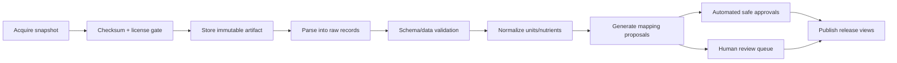

# Data source, quality và governance

**Phiên bản:** 1.0.0  
**Trạng thái:** Normative data governance policy  
**Liên quan:** Source adapter contract và release management


## 1. Data philosophy

Dữ liệu dinh dưỡng không phải một bảng chân lý duy nhất. Mỗi giá trị có:

- Source.
- Release/version.
- Food identity/matching quality.
- Basis và unit.
- Method.
- Geography/time.
- Derivation status.
- Quality grade.

Hệ thống phải bảo toàn các chiều này.

## 2. Source classes

### USDA FoodData Central

Dùng cho foundation/basic foods, survey foods, branded records và historical references. Các data types có semantics khác nhau; importer giữ nguyên `source_data_type`.

### Vietnamese/national food composition sources

Ưu tiên cho food/món/portion địa phương khi license và documentation cho phép. Dữ liệu cũ không tự động bị loại nhưng temporal relevance phải thấp hơn nếu không đại diện formulation hiện tại.

### Open Food Facts

Dùng enrichment cho branded products/barcode. Không coi community data là verified mặc định. Phải tuân thủ ODbL và attribution/share-alike obligations theo legal review.

### Manufacturer/restaurant data

Exact product/menu có specificity cao nhưng có thể thiếu nutrient hoặc thay formulation. Lưu effective dates và raw label/menu evidence.

### Internal curated recipes/cooking trials

Quan trọng cho món Việt và portion. Cần protocol, reviewer và version.

### User-contributed data

Chỉ có giá trị cá nhân hoặc proposal. Không trở thành global truth tự động.

## 3. Source register

Mỗi source phải có record:

- Owner/publisher.
- License.
- Permitted uses.
- Attribution requirement.
- Redistribution constraint.
- Update cadence.
- Data types.
- Geographic scope.
- Known limitations.
- Import owner.
- Last reviewed date.

Không import source chưa có license status.

## 4. Ingestion pipeline



## 5. Idempotency

- Dataset + version unique.
- Artifact checksum unique trong dataset.
- Source external ID unique trong release.
- Re-run importer cho cùng artifact không tạo duplicate.
- Mapping proposals có deterministic fingerprint.
- Publish release atomic ở metadata level.

## 6. Raw preservation

Giữ:

- Original downloaded file.
- Checksum.
- Importer version.
- Raw record payload.
- Parsing errors.
- Timestamp.

Không overwrite raw payload để “sửa”. Corrections nằm ở normalized/canonical layer.

## 7. Nutrient normalization

Mapping external nutrient sang internal vocabulary phải có:

- External code/name.
- Internal nutrient ID.
- Unit conversion.
- Denominator/basis.
- Method indicator khi có.
- Mapping status/reviewer.

Không map theo tên gần giống khi semantic khác. Ví dụ total carbohydrate definitions có thể khác theo source; policy cần domain review.

## 8. Food matching quality

Food mapping review xem xét:

- Food source/species.
- Part/cut.
- Processing state.
- Cooking method.
- Added ingredients.
- Fat/moisture state.
- Brand/formulation.
- Geography.
- Fortification.

Mapping types:

- Exact.
- Broader.
- Narrower.
- Approximate.
- Rejected.

Approximate mapping không được có cùng selection priority với exact mapping.

## 9. Quality dimensions

### Analytical quality

Method, lab/sample metadata, detection/uncertainty.

### Specificity

Exact product/food/state hay generic group.

### Geographic relevance

Việt Nam/regional versus foreign proxy.

### Temporal relevance

Current formulation/portion versus historical data.

### Completeness

Coverage nutrients cần thiết.

### Derivation quality

Measured > declared/compiled/calculated > estimated, nhưng exact branded label có thể phù hợp hơn generic measured profile cho đúng SKU. Vì vậy không dùng một thứ tự tuyệt đối duy nhất.

### Verification

Curated/reviewed status.

## 10. Quality grade

Grade tổng hợp dùng cho operational selection, không giả là scientific universal score.

- **A:** exact identity, documented method/source, current, reviewed.
- **B:** strong match, credible source, minor limitations.
- **C:** usable proxy hoặc recipe calculation có assumptions.
- **D:** weak approximation, chỉ dùng kèm warning/range.
- **U:** unknown/unassessed; không dùng mặc định production.

Lưu dimension scores riêng trong metadata để grade giải thích được.

## 11. Selection policy

Pseudocode:

```text
filter published + valid date + convertible basis
score exact identity
score method/source quality
score geography/time
score recipe/brand context
penalize approximate mapping
penalize missing required nutrients
choose profile or return insufficient
```

Policy version được lưu trên analysis revision.

Không ghép nutrient giữa profiles trong default path. Nếu cần compiled profile:

- Tạo explicit compilation run.
- Ghi source profile cho từng value.
- Publish compiled profile như entity riêng.

## 12. Conflict handling

Khi hai credible profiles chênh đáng kể:

1. Không average tự động.
2. Kiểm identity/basis/unit trước.
3. Kiểm raw/cooked, edible/as-purchased.
4. Kiểm temporal/geographic/formulation.
5. Chọn theo context hoặc tạo separate food/profile variant.
6. Mở data-quality issue nếu vẫn không giải thích được.

## 13. Data validation rules

### Structural

- Required IDs/fields.
- Valid unit.
- Unique nutrient per profile.
- Positive basis.
- Valid foreign keys.

### Plausibility

- Nutrient không âm.
- Macronutrient/energy range hợp lý theo food group nhưng không reject mù quáng.
- Sum components có thể vượt 100 g do measurement definitions/rounding; flag, không auto-fix.
- Sodium/salt unit conversion checked.
- kcal/kJ consistency flagged.

### Cross-release

- Record removed/added count anomaly.
- Large value changes.
- Changed description/brand.
- Mapping impact count.

## 14. Publish workflow

```text
draft
→ automated validation
→ reviewer queue
→ approved
→ published
→ deprecated/superseded
```

Roles:

- Importer: tạo raw/normalized proposals.
- Curator: review semantic mappings/recipes/portions.
- Domain reviewer: approve calculation-sensitive changes.
- Admin: emergency rollback/permissions.

## 15. Change impact analysis

Trước publish recipe/profile/portion update, hệ thống tính:

- Số canonical foods ảnh hưởng.
- Số default selections thay đổi.
- Expected nutrient delta trên benchmark meals.
- Existing analyses có thể thay đổi nếu recalculated.

Không cần update historical snapshots.

## 16. Data release model

Tạo internal `catalog_release` chứa:

- Included dataset releases.
- Mapping policy version.
- Published recipe/profile revisions.
- Portion dataset revision.
- Created/published timestamps.

Analysis lưu release identifier hoặc đầy đủ evidence IDs. Release giúp reproducibility và rollback.

## 17. Curation UI requirements

- Side-by-side raw vs canonical.
- Search existing foods trước tạo mới.
- Merge preview.
- Nutrient profile comparison.
- Recipe dependency graph.
- Portion observations theo region/source.
- Bulk approve only low-risk deterministic mappings.
- Audit history.
- Review queues theo impact/uncertainty/frequency.

## 18. User feedback governance

Correction được phân loại:

- Parser error.
- Food resolution error.
- Portion error.
- Recipe mismatch.
- Composition dispute.

Promotion policy:

```text
single correction → personal revision
repeated aggregate signal → proposal
proposal + evidence/review → canonical change
```

Không dùng popularity đơn thuần để xác nhận nutrient truth.

## 19. Licensing controls

- License metadata ở dataset level.
- Export endpoint kiểm source obligations.
- ODbL-derived database design cần legal review trước redistribution.
- Attribution text/version được quản lý tập trung.
- Không đưa raw proprietary source vào client response nếu không được phép.

## 20. Data retention

- Raw public dataset artifacts: giữ theo reproducibility/storage policy.
- Superseded canonical versions: giữ audit.
- User raw meal text: retention riêng và deletable.
- Telemetry samples: ngắn hơn, redacted.
- Provider prompts/responses: tối thiểu cần thiết.

## 21. Data quality KPIs

- Approved exact mapping ratio.
- Approximate mapping usage rate.
- Low-quality profile selection rate.
- Missing nutrient rate.
- Unknown food frequency.
- Correction rate theo food/alias/unit.
- Portion evidence width.
- Source freshness lag.
- Publish rollback count.

## 22. Official reference principles

- USDA FoodData Central giữ nhiều data type và phát hành downloadable datasets/API.
- FAO/INFOODS nhấn mạnh food matching, unit/denominator normalization và data checking.
- EuroFIR phân biệt weight yield và nutrient retention trong recipe calculation.
- FoodOn/LanguaL cho thấy food nên được mô tả đa facet; blueprint chỉ áp dụng lightweight internal facets.
- Open Food Facts data sử dụng Open Database License; integration phải review nghĩa vụ license.

## 23. v1.0 source adapter requirement

Every external dataset must implement the lifecycle and metadata contract in `18_SOURCE_ADAPTER_CONTRACT.md`. Direct ad-hoc import scripts are allowed only for exploration and cannot activate production data.

## 24. Source activation governance

- Staged release is queryable only by review tools/evaluation.
- Validation and impact report required.
- Approval roles separated from importer automation where practical.
- Activation pointer and previous release recorded.
- Rollback drill required for critical sources.

## 25. Open-source/data reuse gate

Before adopting repository code/data/model:

- pin commit/version;
- record license and asset-specific terms;
- check attribution/share-alike/network-copyleft implications;
- security scan;
- data provenance review;
- removal/upgrade plan.

See `15_OPEN_SOURCE_AND_MARKET_REFERENCE_STRATEGY.md`.

## 26. Curation service levels

Measure:

- queue age by severity;
- unresolved high-frequency foods;
- mapping disagreement rate;
- publish lead time;
- merge/rollback incidence;
- curator throughput without using throughput as sole quality target.

## 27. Data release quality gate

A release cannot activate with:

- unresolved license change;
- checksum/schema mismatch;
- critical plausibility failures;
- material benchmark regression unexplained;
- mapping changes without review policy;
- inability to rollback.
