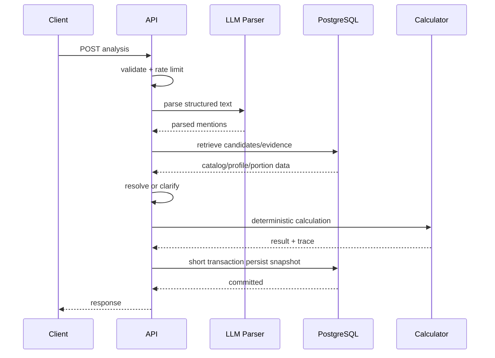

# API và runtime architecture

**Phiên bản:** 1.0.0  
**Trạng thái:** Development baseline  
**Runtime:** Conditional Rust decision per ADR-001


## 1. Technology baseline

### Backend

- Rust stable toolchain, pinned bằng `rust-toolchain.toml`.
- Axum/Tokio/Tower.
- Serde.
- SQLx với PostgreSQL, offline query metadata trong CI.
- `tracing` + OpenTelemetry.

Version dependency phải pin trong `Cargo.lock`; tài liệu không hard-code “latest” như một invariant. Upgrade theo dependency review và compatibility tests.

### Data/infrastructure

- PostgreSQL stable supported version.
- S3-compatible object storage.
- Managed container runtime.
- Hosted LLM qua provider adapter.
- PostgreSQL-backed jobs/outbox.

## 2. Repository layout

```text
nutrition-backend/
├── Cargo.toml
├── Cargo.lock
├── rust-toolchain.toml
├── crates/
│   ├── domain/
│   ├── application/
│   ├── api-http/
│   ├── persistence-postgres/
│   ├── llm-adapter/
│   ├── dataset-import/
│   ├── worker/
│   └── observability/
├── migrations/
├── prompts/
├── schemas/
├── fixtures/
├── docs/
└── deploy/
```

Không chia crate quá nhỏ ở ngày đầu. Có thể bắt đầu 4–5 crates, tách khi compile/dependency/ownership cần.

## 3. Module boundaries

### Domain

- IDs/newtypes.
- Entities/value objects.
- Calculation engine.
- Policies/interfaces.
- Domain errors/events.

### Application

- Use cases.
- Transaction orchestration.
- Ports.
- Authorization decisions cấp use case.

### Adapters

- HTTP DTO/routes.
- SQLx repositories.
- LLM clients.
- Object storage.
- Telemetry.

## 4. Primary endpoint

```http
POST /v1/nutrition/analyses
Idempotency-Key: <opaque-key>
Content-Type: application/json
```

Request:

```json
{
  "text": "Trưa ăn một tô bún bò thêm hai miếng chả",
  "locale": "vi-VN",
  "occurred_at": "2026-07-23T12:30:00+07:00",
  "mode": "balanced"
}
```

Modes:

- `fast`: hạn chế clarification, trả assumptions/range.
- `balanced`: default.
- `precise`: hỏi clarification nếu có material uncertainty.

Mode không thay đổi source truth, chỉ thay decision threshold/interaction.

## 5. Completed response

```json
{
  "analysis_id": "...",
  "revision": 1,
  "status": "completed",
  "items": [
    {
      "item_id": "...",
      "source_text": "một tô bún bò",
      "food": {
        "id": "...",
        "name": "Bún bò Huế"
      },
      "portion": {
        "display": "1 tô",
        "estimated_mass_g": 550,
        "lower_mass_g": 430,
        "upper_mass_g": 700,
        "evidence_quality": "C"
      },
      "nutrition": {
        "energy_kcal": {"value": 510, "lower": 399, "upper": 649},
        "protein_g": {"value": 24.8},
        "carbohydrate_g": {"value": 60.1},
        "fat_g": {"value": 17.3}
      },
      "quality_label": "medium",
      "assumptions": ["Sử dụng khẩu phần tô tiêu chuẩn"]
    }
  ],
  "totals": {},
  "warnings": [],
  "provenance": {
    "catalog_release": "2026.07.1",
    "calculation_engine_version": "1.0.0"
  }
}
```

## 6. Clarification response

Có thể dùng `200` với workflow status hoặc `202`; chốt MVP dùng `200` domain response để client đơn giản:

```json
{
  "analysis_id": "...",
  "revision": 1,
  "status": "needs_clarification",
  "question": {
    "id": "q1",
    "text": "Bạn ăn bún bò Huế hay bún bò Nam Bộ?",
    "options": [
      {"id": "a", "label": "Bún bò Huế"},
      {"id": "b", "label": "Bún bò Nam Bộ"},
      {"id": "unknown", "label": "Không chắc"}
    ]
  },
  "partial_result": null
}
```

Submit:

```http
POST /v1/nutrition/analyses/{id}/clarifications
```

```json
{"question_id":"q1","option_id":"a"}
```

Tạo revision mới hoặc tiếp tục draft workflow; completed revisions bất biến.

## 7. Correction endpoint

```http
POST /v1/nutrition/analyses/{id}/corrections
```

```json
{
  "base_revision": 1,
  "item_corrections": [
    {
      "item_id": "...",
      "food_id": "...",
      "quantity": 0.5,
      "unit": "tô"
    }
  ]
}
```

Optimistic concurrency: reject `409 revision_conflict` nếu base revision cũ.

## 8. Read endpoints

- `GET /v1/nutrition/analyses/{id}`.
- `GET /v1/nutrition/analyses/{id}/revisions/{n}`.
- `GET /v1/nutrition/analyses/{id}/evidence` với quyền phù hợp.
- `GET /v1/foods/search?q=...` cho correction UI.

Không expose raw source payload mặc định.

## 9. Error model

```json
{
  "error": {
    "code": "unsupported_portion",
    "message": "Không đủ dữ liệu để quy đổi khẩu phần này.",
    "request_id": "...",
    "details": {}
  }
}
```

Codes:

- invalid_request.
- text_too_long.
- parser_unavailable.
- analysis_insufficient.
- unsupported_portion.
- unknown_food.
- revision_conflict.
- rate_limited.
- internal_error.

Không trả SQL/provider internal error cho client.

## 10. Idempotency

- Client gửi key cho create/correction.
- Scope theo user + endpoint + key.
- Store request hash và response/revision reference.
- Cùng key, khác body → `409 idempotency_conflict`.
- TTL theo product retry window nhưng persisted analysis vẫn độc lập.

## 11. Authentication/authorization

- Public anonymous analysis có thể hỗ trợ với token/session và stricter rate limit.
- Account history yêu cầu auth.
- Curation endpoints dùng RBAC.
- Roles: user, curator, domain_reviewer, admin, importer_service.
- Service-to-service dùng workload identity/short-lived credentials.

## 12. Request execution flow



## 13. Timeouts and budgets

Suggested initial budgets:

- HTTP total: 10 s.
- LLM call: 5 s, one retry only within remaining budget.
- DB statement: 1 s default; import jobs separate.
- Candidate query: 200 ms target.
- Persist transaction: 500 ms target.

Timeout values phải config và benchmark.

## 14. Concurrency/backpressure

- Limit concurrent LLM calls per instance/provider.
- Queue or reject với `429/503` khi saturation.
- DB pool bounded; không set pool quá lớn theo instance count.
- Request body limit.
- Tower middleware cho timeout, load shedding và tracing.

## 15. Background jobs

Jobs:

- Dataset import.
- Mapping proposal generation.
- Recipe recalculation/profile materialization.
- Quality scan.
- Feedback aggregation.
- Data deletion.
- Outbox delivery.

Worker claim:

```sql
SELECT id
FROM ops.job
WHERE status IN ('queued','retry')
  AND available_at <= now()
ORDER BY available_at
FOR UPDATE SKIP LOCKED
LIMIT $n;
```

Jobs phải idempotent, có max attempts, backoff và dead-letter status trong DB.

## 16. Caching

MVP:

- Small in-process cache cho immutable published lookup, bounded TTL/size.
- Cache key có catalog release/policy version.
- Không cache user-specific analysis globally.
- Không thêm Redis trước metrics.

Potential cache:

- Nutrient vocabulary.
- Active preferred names.
- Published recipe calculated profiles.
- Portion observations.

## 17. Deployment

### Components

- API container.
- Worker container cùng image/different command.
- Managed PostgreSQL.
- Object storage.
- Secret manager.
- OpenTelemetry collector hoặc vendor endpoint.

### Environments

- Local: Docker Compose/PostgreSQL, fake parser.
- CI: ephemeral PostgreSQL, SQLx prepare/check.
- Staging: real provider với capped budget, anonymized fixtures.
- Production: separate credentials/data.

## 18. Configuration

Typed config từ environment/secret references:

- Database URL/pool.
- LLM provider/model/timeouts.
- Object storage.
- Feature flags.
- Policy versions.
- Telemetry sampling.

Startup fail-fast cho required config. Không log secrets.

## 19. Release strategy

- Database expand migration.
- Deploy backward-compatible code.
- Backfill.
- Feature flag new policy/model.
- Shadow/offline evaluation.
- Canary percentage.
- Contract/cleanup migration sau.

Prompt/model upgrade được coi như behavior release, không chỉ config edit.

## 20. Graceful degradation

### LLM unavailable

- Rule parser cho simple input nếu confidence high.
- Hoặc trả retryable error; không fabricate.

### Data source/import unavailable

- API dùng last published internal release.

### Low-quality evidence

- Return low/insufficient with assumptions.

### Telemetry unavailable

- Request không fail; exporter buffered/bounded.

## 21. API versioning

- URL major version `/v1`.
- Additive fields backward compatible.
- Enum additions phải client-tolerant.
- Breaking semantics cần `/v2` hoặc explicit negotiated schema.
- Internal engine/catalog versions nằm trong provenance, không phải API major.

## 22. v1.0 stateful interaction endpoints

Recommended endpoints:

```http
POST /v1/nutrition/analyses
POST /v1/nutrition/analyses/{id}/clarifications/{question_id}/answers
POST /v1/nutrition/analyses/{id}/corrections
POST /v1/nutrition/analyses/{id}/confirmations
GET  /v1/nutrition/analyses/{id}
GET  /v1/nutrition/analyses/{id}/revisions
```

Clarification answer/correction must include expected revision or ETag-style version to prevent stale writes.

## 23. Transaction rule

Never hold a database transaction while calling:

- LLM provider;
- external nutrition API;
- object storage download;
- remote identity service beyond normal auth verification.

Use short persistence transactions and explicit orchestration states.

## 24. Provider anti-corruption boundary

Provider SDK types remain in adapter crate. Application sees stable internal DTOs. Provider-specific IDs/claims must not leak into public API except in provenance details explicitly modeled.

## 25. Runtime topology by phase

### Walking skeleton

```text
api/worker in one binary or two commands
PostgreSQL
local object storage optional
hosted LLM
```

### MVP

```text
api replicas
worker replicas
managed PostgreSQL
object storage
LLM provider
observability collector/backend
```

No distributed cache/broker unless ADR trigger met.

## 26. API response quality fields

Use categorical/structured fields rather than fake precision:

```json
{
  "resolution_status": "resolved_with_assumptions",
  "data_quality": "moderate",
  "is_estimate": true,
  "assumptions": [],
  "bounded_range": null
}
```

## 27. Operational SLO linkage

Runtime budgets and availability targets are normative in `02_PRODUCT_SCOPE_AND_REQUIREMENTS.md`; telemetry and alerts in file 09 must report against those targets.
