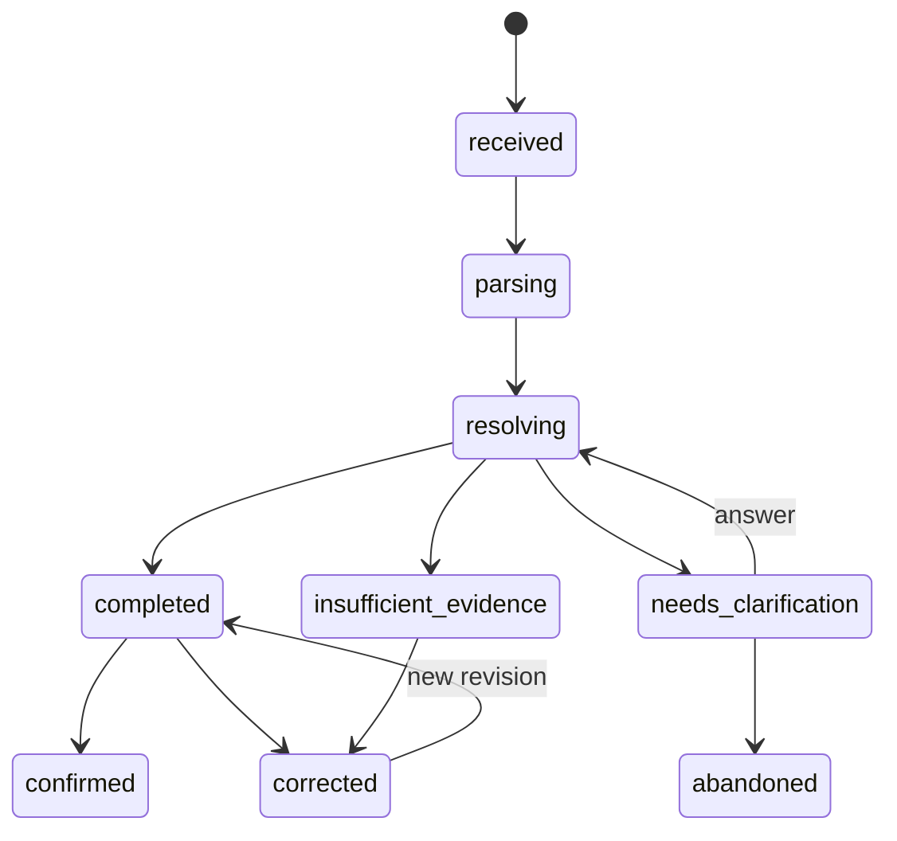

# Clarification và correction UX specification

**Phiên bản:** 1.0.0  
**Mục tiêu:** Biến uncertainty thành interaction ngắn, rõ và có thể đo

## 1. Principle

Hệ thống không được chọn giữa hai extreme:

- đoán im lặng;
- hỏi người dùng mọi chi tiết.

Nó phải hỏi khi thông tin bổ sung có khả năng giảm sai số material và câu hỏi dễ trả lời.

## 2. Analysis state machine



Allowed transitions phải được enforce ở application layer và database status history.

## 3. Clarification decision

Candidate question được rank theo:

```text
expected nutrition error reduction
× answerability
× user effort inverse
× downstream reuse value
```

MVP có thể dùng heuristic, nhưng phải version và evaluate.

## 4. Question types

### Identity question

“Bạn ăn bún bò Huế hay bún bò Nam Bộ?”

### Portion question

“Bát cơm này gần với bát nhỏ, vừa hay lớn?”

### Consumption question

“Bạn có uống phần lớn nước phở không?”

### Modifier question

“Trà sữa của bạn là 30%, 50% hay 70% đường?”

Không hỏi detail nếu các answer không làm thay đổi estimate đủ lớn.

## 5. Interaction constraints

- Một dimension mỗi turn.
- 2–5 options, cộng “khác/không chắc” khi phù hợp.
- Text ngắn, không jargon.
- Không hiển thị internal scores.
- Default maximum: 2 clarification turns cho một analysis trong MVP.
- User có thể bỏ qua và nhận range hoặc `insufficient`, tùy policy.
- State/resume idempotent.

## 6. Clarification response contract

```json
{
  "analysis_id": "an_123",
  "revision": 1,
  "status": "needs_clarification",
  "question": {
    "id": "q_1",
    "dimension": "food_identity",
    "prompt": "Bạn ăn bún bò Huế hay bún bò Nam Bộ?",
    "options": [
      {"id": "food_a", "label": "Bún bò Huế"},
      {"id": "food_b", "label": "Bún bò Nam Bộ"},
      {"id": "other", "label": "Khác / không chắc"}
    ]
  },
  "expires_at": null
}
```

Answer endpoint phải reject stale question/revision conflict bằng explicit error.

## 7. Correction model

Correction có thể sửa:

- canonical food;
- quantity/unit/grams;
- modifier;
- consumed fraction;
- remove/add item;
- recipe/variant nếu user biết;
- timestamp/meal grouping.

Correction không sửa published catalog trực tiếp.

## 8. Revision semantics

```text
revision 1: initial interpretation
revision 2: clarification answer applied
revision 3: user corrected portion
```

Mỗi revision pin evidence và result riêng. `current_revision_id` chỉ là pointer; history không bị xóa.

## 9. Feedback promotion

User correction trở thành:

```text
private analysis correction
→ aggregated error signal
→ curator candidate
→ reviewed alias/portion/mapping
→ published catalog change
```

Không auto-promote correction thành canonical data.

## 10. UX result hierarchy

1. Total estimated energy/macros.
2. Item breakdown.
3. Main assumptions/uncertain items.
4. Edit/correct action.
5. Detailed evidence/source on demand.

Không đưa provenance kỹ thuật quá sâu lên màn hình chính, nhưng phải truy cập được.

## 11. False precision controls

- Portion uncertain → range hoặc rounded value.
- Không hiện `523.47 kcal` cho “một tô”.
- Không dùng “confidence 87%” khi chưa calibrated.
- Highlight assumption có impact lớn nhất.

## 12. Accessibility/localization

- Options không chỉ phân biệt bằng màu.
- Screen-reader labels.
- Numeric/unit formatting theo locale.
- Tên món giữ dấu; search hỗ trợ không dấu.
- Regional labels phải trung tính và dễ hiểu.

## 13. Product metrics

- Clarification trigger rate.
- Answer rate.
- Abandonment rate.
- Average turns.
- Error reduction sau answer.
- Correction rate sau clarification.
- Time to finalized analysis.
- Most common unresolved dimensions.

## 14. Acceptance gates

- ≥ 90% controlled flows cần tối đa một turn, trừ intentionally hard set.
- Mỗi question option map tới valid domain action.
- Stale/replay answer idempotency tested.
- Correction history/revert semantics tested.
- Usability participants hiểu “ước tính” và assumption chính.
